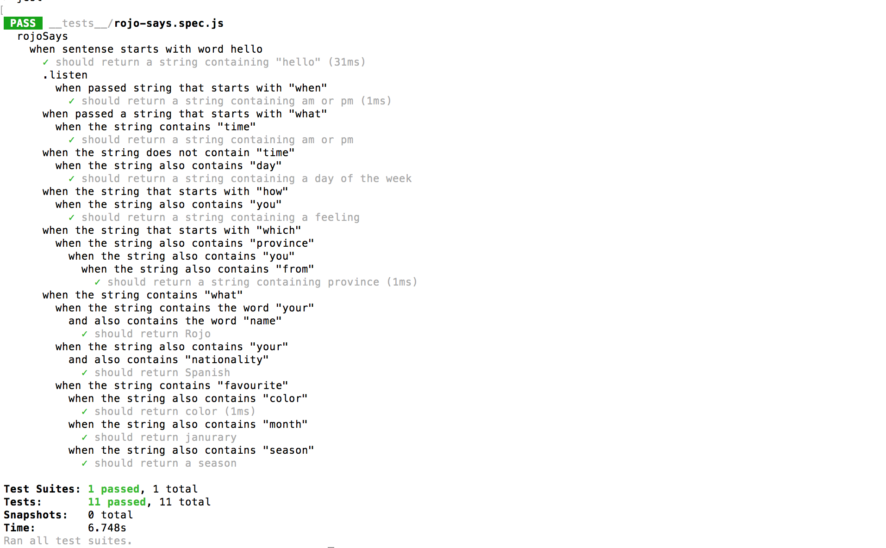

# TDD-Testing-Rojo

## Summary

The purpose of the TDD-Rojo project was to explore, practice, and gain a better understanding of
behavior and test-driven development. In the early processes of this project, I mapped out the different
tests that I wanted to run with Rojo using BDD. Once I understood what I wanted to test, I wrote
a series of Jest tests that anticipated the results of a number of questions. Once this was mapped out,
te applications conditional statements were written in accordance to the Jest TDD tests.

## Languages and Tools Used

    * JavaScript
    * Jest

## Learning Outcomes

This project has allowed me to take a different approach to programming, a test-driven approach. It has 
helped me understand the importance of testing and how it is crucial to the development of predictable, dependable,
and pure application functionality. 